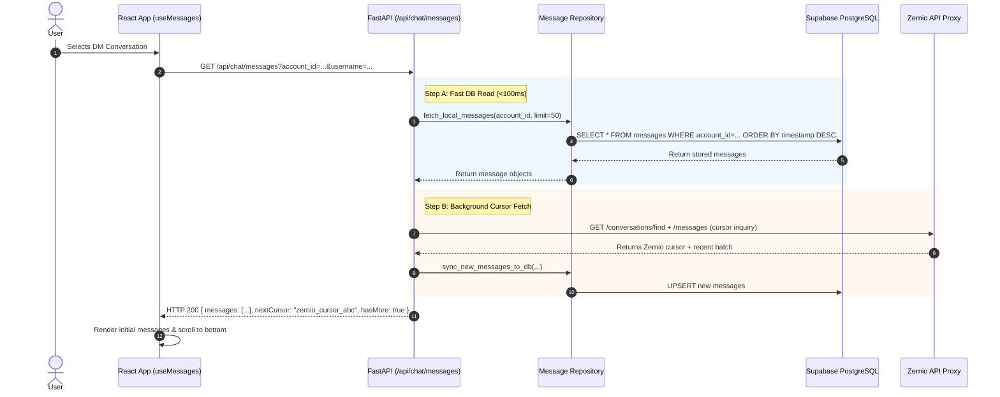
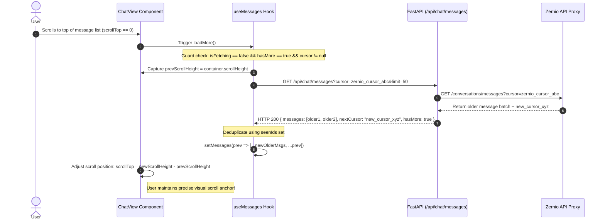
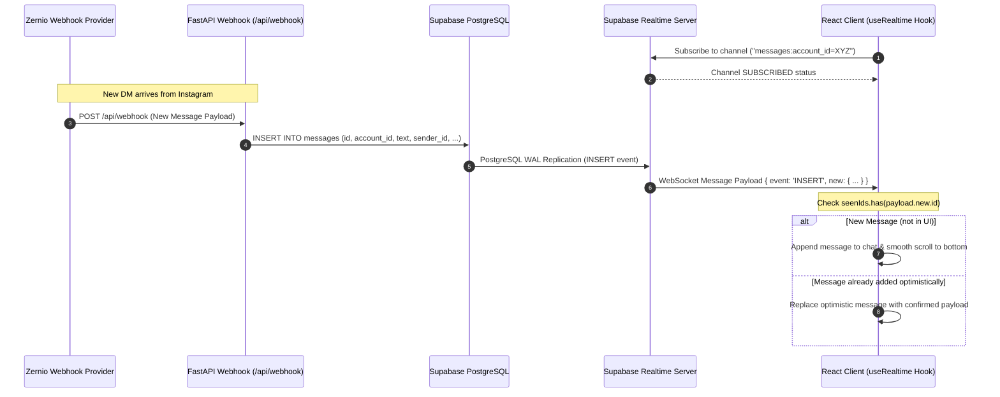
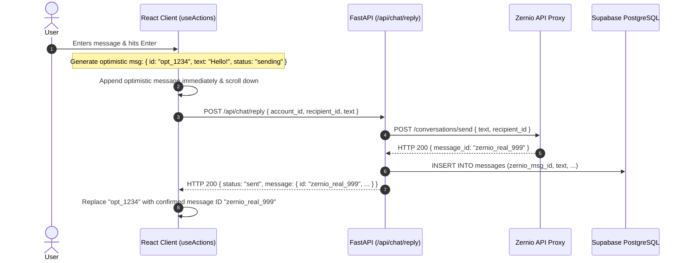
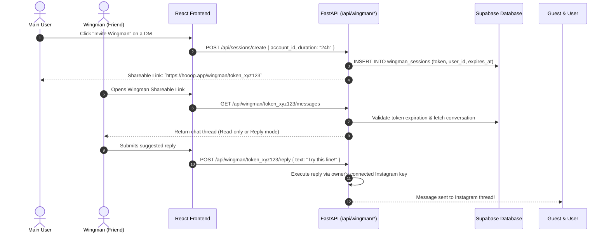

# Data & Message Flows

This document details the step-by-step data flows, network communication protocols, and sequence diagrams for key user interactions in **Hooop**.

---

## 1. Initial Message Loading Flow (DB-First + Background Cursor Fetch)

To make chat loading feel instant, Hooop immediately reads stored messages from Supabase DB on open, while requesting the pagination cursor from Zernio in the background.

---

## 2. Scroll-Up Pagination Flow (Older Message Loading)

When a user scrolls to the top of the chat view, Hooop uses the stored cursor to fetch older messages directly from Zernio and prepends them seamlessly.

---

## 3. Realtime Message Updates Flow (Supabase Realtime)

Incoming DMs and sent message confirmations stream instantly to the client over WebSockets without polling.

---

## 4. Message Sending & Optimistic UI Flow

When a user types a reply and presses Enter, the UI instantly displays the message before network confirmation.

---

## 5. Wingman Session Flow (Helping a Friend Out)

When a user runs out of words, they can invite a wingman using a secure guest token.

