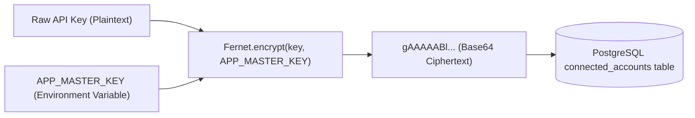
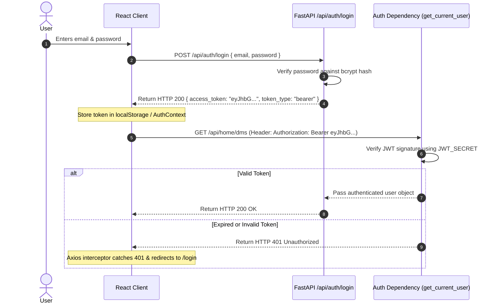

# Security & BYOK Architecture

Security and privacy are core architectural pillars of **Hooop**. This document explains our **Bring Your Own Key (BYOK)** encryption model, API credential protection, and JWT authentication lifecycle.

---

## Bring Your Own Key (BYOK) Model

Hooop operates under a **Bring Your Own Key** model for connected social accounts. Instead of storing central access tokens that expose all users if compromised, every connected Instagram account uses an encrypted key associated directly with that user.

### Key Principles:
1. **Zero Plaintext Key Storage**: User API keys are encrypted at the moment they enter the system. Raw keys are never stored in database tables, logs, or backups.
2. **Cryptographic Key Isolation**: If a database dump is leaked, keys remain unreadable without the application master key.
3. **Frontend Obfuscation**: Plaintext keys are never sent back to the browser in API responses. The frontend only receives masked indicators (e.g. `••••••••key_suffix`).

---

## Symmetric Fernet Encryption (`crypto.py`)

All API keys stored in PostgreSQL are encrypted using **Fernet AES-128-CBC** with HMAC authentication, provided by Python's standard `cryptography.fernet` library.

### Encryption Pipeline:



### Python Implementation (`crypto.py`):
```python
from cryptography.fernet import Fernet
from config import settings

# Initialize Fernet suite with server master key
fernet = Fernet(settings.APP_MASTER_KEY)

def encrypt_key(plain_key: str) -> str:
    """Encrypts a plaintext API key for DB storage."""
    return fernet.encrypt(plain_key.encode()).decode()

def decrypt_key(encrypted_key: str) -> str:
    """Decrypts a stored ciphertext API key for runtime API requests."""
    return fernet.decrypt(encrypted_key.encode()).decode()
```

> [!IMPORTANT]
> `APP_MASTER_KEY` must be a 32-byteurl-safe base64-encoded key. Generate one securely using:
> ```bash
> python3 -c "from cryptography.fernet import Fernet; print(Fernet.generate_key().decode())"
> ```

---

## JWT Authentication & Token Lifecycle

Authentication between the React frontend and FastAPI backend relies on signed **JSON Web Tokens (JWT)**.


